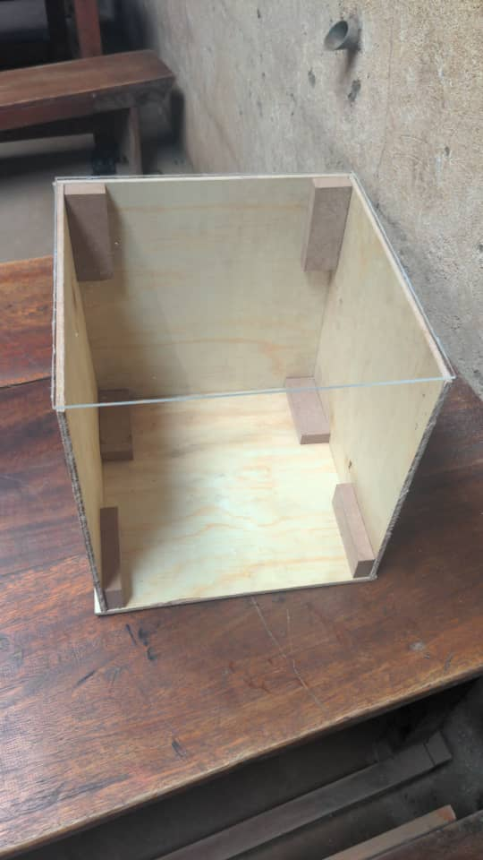
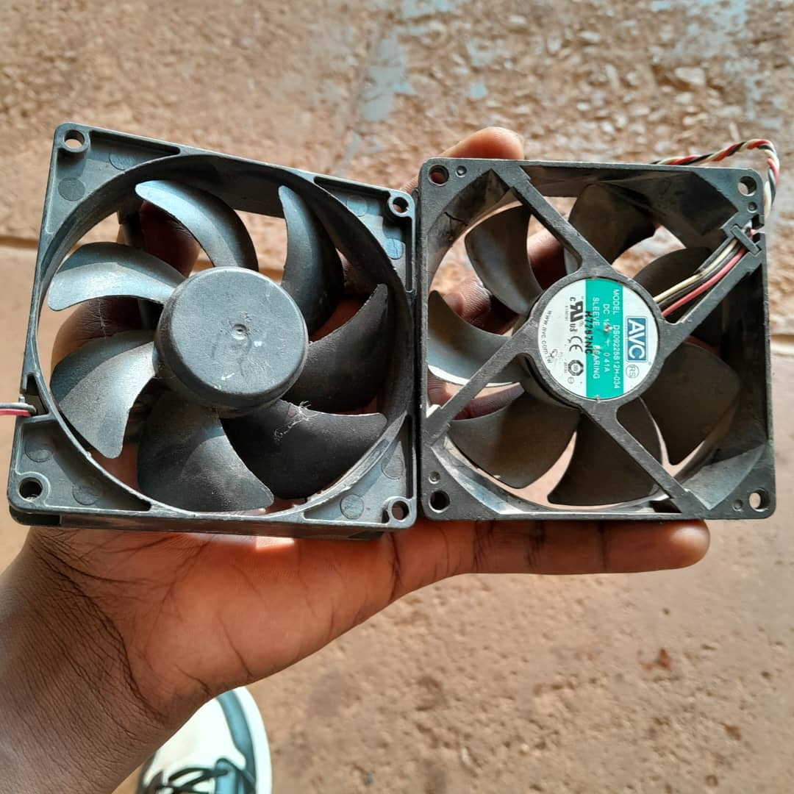
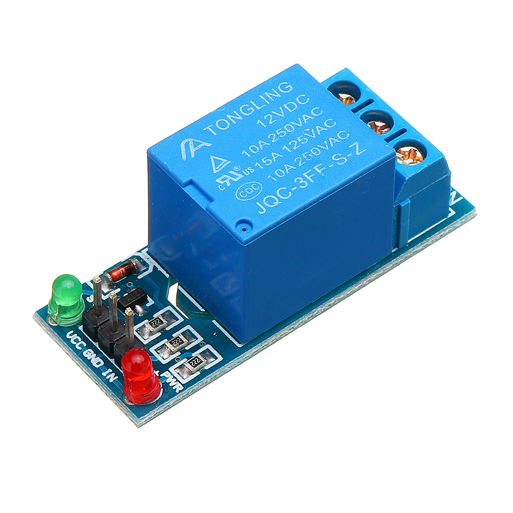
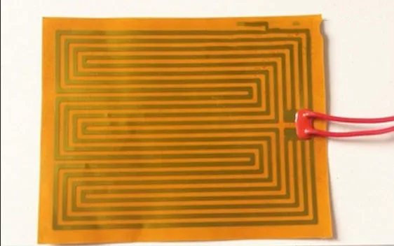
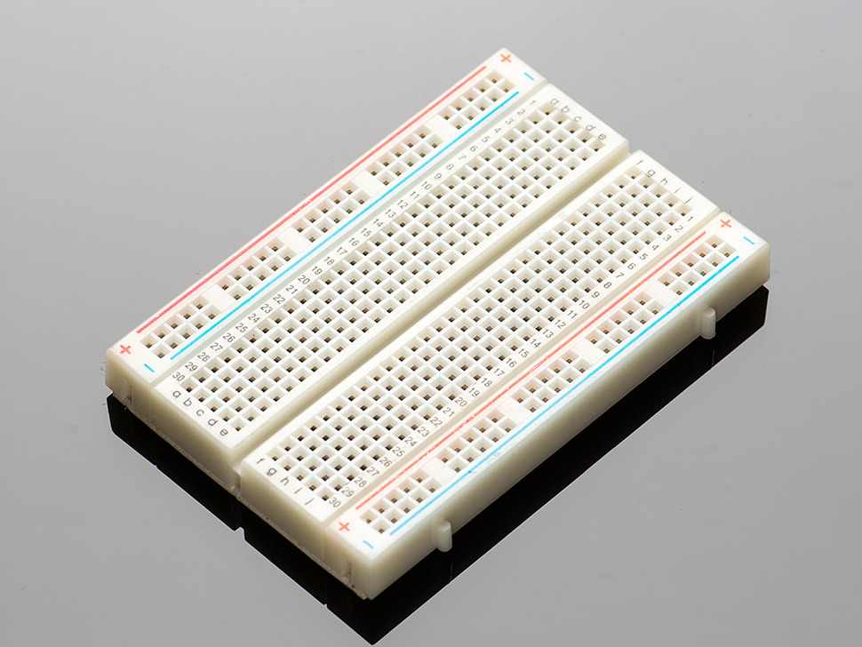
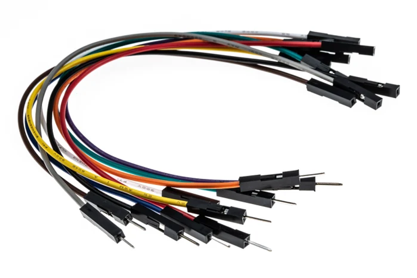
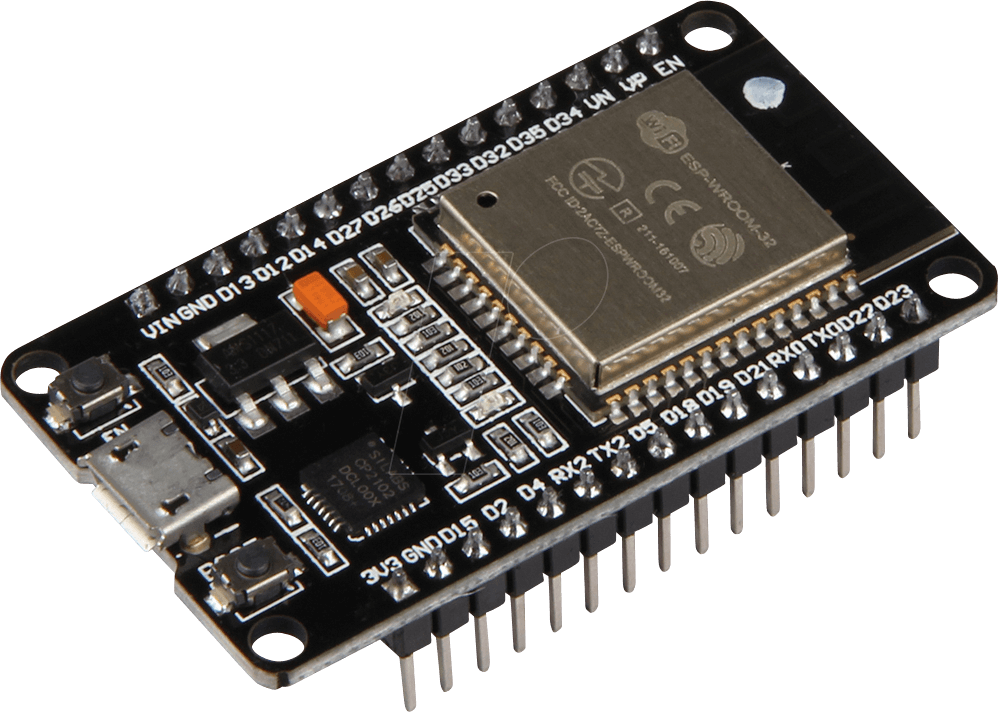
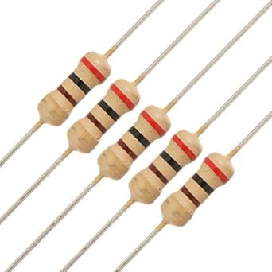
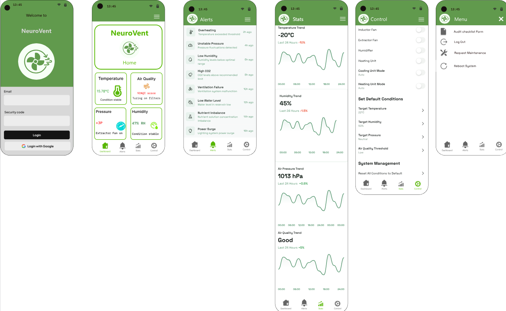

# Automated Laboratory Log Management System (ALMS)

ALMS is an embedded system designed to automate the monitoring and control of biomedical lab conditions, aligned with ISO 15189:2022 standards. The system leverages an ESP32 microcontroller to read environmental data and remotely control lab equipment through a mobile app.

## Features

- Embedded environmental monitoring (Temperature, Humidity, Pressure)
- Auto/Manual mode switching
- Thermo heating element(To stimulate changes in the dummy Lab)
- Fan control via relays
- Real-time data via WebSocket
- Local web server (ESP32 Access Point)
- Mobile app dashboard interface


## Procedure for Running the Code

1. **Hardware Setup**
   - Connect **BME280 sensor** to ESP32:
     - SDA → GPIO 21  
     - SCL → GPIO 22  
     - VCC → 3.3V  
     - GND → GND
   - Connect **relays**:
     - GPIO 5 → Intake Fan  
     - GPIO 4 → Exhaust Fan 1  
     - GPIO 15 → Exhaust Fan 2  
   - Power all components using a breadboard with jumper wires and resistors.

2. **Install Arduino IDE & ESP32 Board Support**
   - Add this URL to *Preferences > Additional Board URLs*:
     ```
     https://raw.githubusercontent.com/espressif/arduino-esp32/gh-pages/package_esp32_index.json
     ```
   - Then go to *Tools > Board > Boards Manager* and install **ESP32 by Espressif Systems**.

3. **Install Required Libraries**
   - From Arduino Library Manager, install:
     - `Adafruit BME280`
     - `Adafruit Unified Sensor`
     - `WebSocketsServer` by Markus Sattler

4. **Upload the Code**
   - Connect ESP32 via USB.
   - Choose board: `ESP32 Dev Module`  
   - Select the correct COM port: `COM 4`  
   - Write or upload ypur code.

5. **Connect to ESP32 Access Point**
   - SSID(Service Set Identifie): `ESP_Conditions`. This is the WiFi name you see when connecting the device.
   - Password: `12345678`

6. **Control via Mobile App**
   - Connect app to `http://192.168.4.1`
   - Use endpoints:
     - `/data` – Sensor data
     - `/mode?type=auto/manual` – Switch modes
     - `/set_conditions?temp=25&humidity=60&pressure=1010` – Manual threshold
     - `/fan_intake?state=on/off` – Fan control
----


### Hardware Components Used
<table>
  <tr>
    <td align="center">
      <p><strong>Dummy Lab</strong></p>
      
    </td>
    <td align="center">
      <p><strong>3 Fans</strong></p>
      
    </td>
    <td align="center">
      <p><strong>Relay Module</strong></p>
      
    </td>
  </tr>
  <tr>
    <td align="center">
      <p><strong>Thermo Element</strong></p>
      
    </td>
    <td align="center">
      <p><strong>Breadboard</strong></p>
      
    </td>
    <td align="center">
      <p><strong>Jump Wires</strong></p>
      
    </td>
  </tr>
  <tr>
    <td align="center">
      <p><strong>ESP32 Board</strong></p>
      
    </td>
    <td align="center">
      <p><strong>Resistors</strong></p>
      
    </td>
    <td align="center">
      <p><strong>BME280 Sensor</strong></p>
      
    </td>
  </tr>
</table>

----

### Dashboard screenshoots


-----

### API Endpoints Summary

| Endpoint | Method | Function |
|----------|--------|----------|
| `/data` | GET | Get current sensor readings |
| `/mode?type=auto/manual` | GET | Switch between auto/manual modes |
| `/set_conditions?temp=..&humidity=..&pressure=..` | GET | Set target conditions (manual mode) |
| `/fan_intake?state=on/off` | GET | Manually control intake fan |
| `/fan_exhaust1?state=on/off` | GET | Manually control exhaust fan 1 |
| `/fan_exhaust2?state=on/off` | GET | Manually control exhaust fan 2 |

-----

## Visit Our Website [Group 24](https://katodesire63.github.io/Mini-Lab-Website/).

